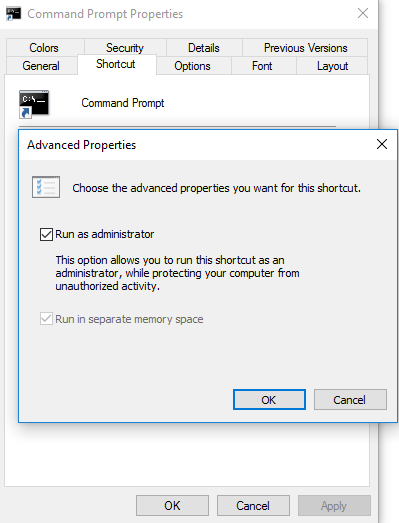
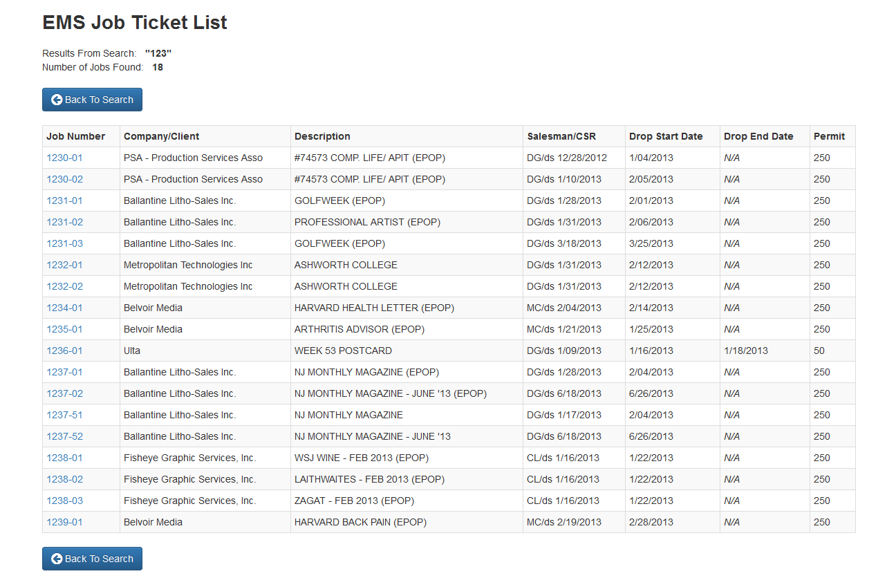
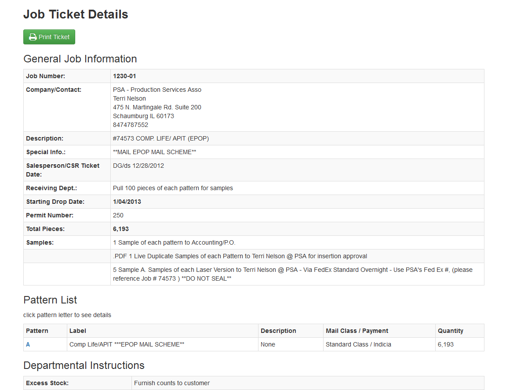
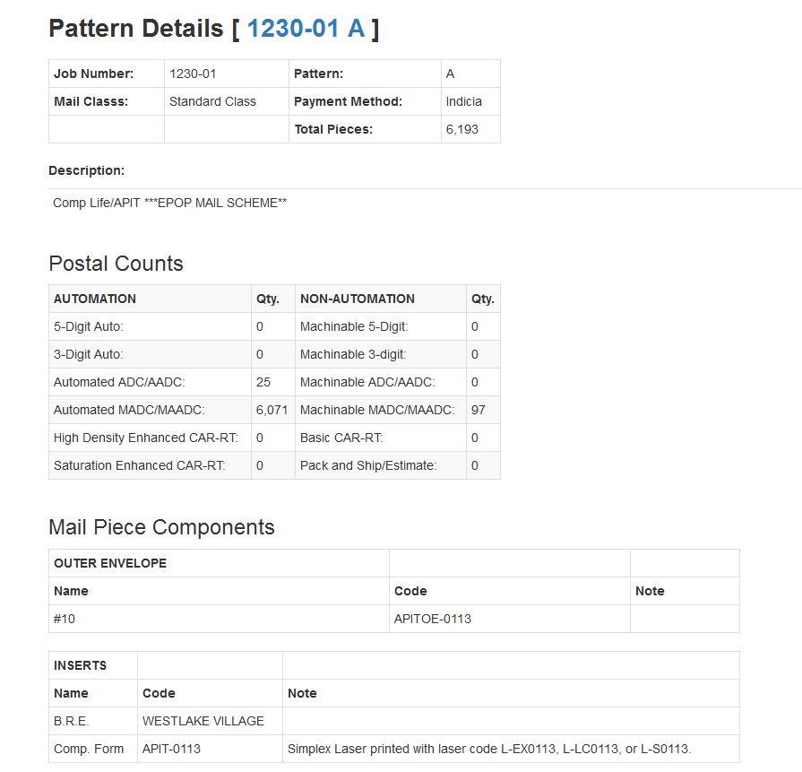

# pyACCESS
## **Django/Python MS ACCESS 97** Data Sharing Demo of a Web GUI (*EMS Job Ticket Explorer*) and Web Service (*API*)

The purpose of this application is to demonstrate the ability to externaly access the EMS Legacy MS ACCESS 97 databases and
serve data to other, more modern, applications via a REST/HTTP API.

The Web GUI is built using **Django**, a *Python-based* Web application framework (https://www.djangoproject.com/).

The REST API is implemented using the Django REST Framework (http://www.django-rest-framework.org/).

This project currently utilizes the **pyodbc** Python library (https://mkleehammer.github.io/pyodbc/) to connect and read from the MS Access Database (.mdb) via ODBC.

This Application is being primarily developed and maintained in a **Windows** (Windows 10) environment 
using **Visual Studio Code** (VS Code) and **Git** for Windows.

### *Below is a journal of step-by-step notes from the development process:*

## Windows Environment Notes
To avoid permission errors/issues when installing Python Tools and Packages from the command line, a **Windows command line** shortcut 
must be created and configured to *"Run as administrator"*



The same must be done with the **Visual Studio Code** shortcut.

## Create & Clone the inital Github repository
Create a new/empty project on the Github Web site with a minimal configuration.

Use the command line to clone the repo to the local folder (Windows 10).
~~~~
C:\py>git clone https://github.com/edbrad/pyACCESS.git
Cloning into 'pyACCESS'...
remote: Counting objects: 8, done.
remote: Compressing objects: 100% (8/8), done.
remote: Total 8 (delta 1), reused 0 (delta 0), pack-reused 0
Unpacking objects: 100% (8/8), done.
~~~~

VS Code's Git intergration allows changes to be commited to the local repository.  Syncing the updates to the the remote
Github repository requires issuing a subsequent Git **push** command from the command line.
~~~~
(venv) C:\py\pyACCESS>git push
Counting objects: 5, done.
Delta compression using up to 2 threads.
Compressing objects: 100% (5/5), done.
Writing objects: 100% (5/5), 4.73 KiB | 0 bytes/s, done.
Total 5 (delta 2), reused 0 (delta 0)
remote: Resolving deltas: 100% (2/2), completed with 2 local objects.
To https://github.com/edbrad/pyACCESS.git
   705eee5..9b27bdb  master -> master
~~~~

To check the current status of the local repo and how it compares to the remote (Github) copy, issue 
the Git **status** command from the command line.
~~~~
(venv) C:\py\pyACCESS>git status
On branch master
Your branch is ahead of 'origin/master' by 1 commit.
  (use "git push" to publish your local commits)
nothing to commit, working tree clean
~~~~

## Create and Activate Python Virtual Environment 
Limit the scope of the Application's dependent packages (the Application's "venv" folder in this case). 
The *activate* script must be run to enable the created Virtual Environment.
~~~~
C:\py>cd pyACCESS

C:\py\pyACCESS>virtualenv venv
Using base prefix 'c:\\program files (x86)\\python35-32'
New python executable in C:\py\pyACCESS\venv\Scripts\python.exe
Installing setuptools, pip, wheel...done.
~~~~
~~~~
C:\py\pyACCESS> venv\Scripts\activate

(venv) C:\py\pyACCESS>
~~~~ 

## Install Django Framework
Use **Python package manager (pip)** to download and install the latest version of **Django**.
~~~~
(venv) C:\py\pyACCESS>pip install django
Collecting django
  Using cached Django-1.10.4-py2.py3-none-any.whl
Installing collected packages: django
Successfully installed django-1.10.4
~~~~

## Initialize the Django *Master* Project
Create a Parent Project (pyACCESS) for the GUI and API Application(s). Test the initial functionality.
~~~~
(venv) C:\py\pyACCESS>django-admin startproject pyACCESS
~~~~

~~~~
(venv) C:\py\pyACCESS\pyACCESS>python manage.py runserver
Performing system checks...

System check identified no issues (0 silenced).

You have 13 unapplied migration(s). Your project may not work properly until you apply the migrations for app(s): admin, auth, contenttypes, sessions.
Run 'python manage.py migrate' to apply them.
December 11, 2016 - 21:07:44
Django version 1.10.4, using settings 'pyACCESS.settings'
Starting development server at http://127.0.0.1:8000/
Quit the server with CTRL-BREAK.
~~~~

## Enable the built-in Admin GUI Web site
Create an inital *super user/admin* acccount which will be granted access to Django's admininstrative backend GUI.
The GUI can used to visually manage Django controlled data (*not possible with the MS ACCESS Data!!!*).  It also provides
a GUI for managing security/user access to the application.
~~~~
(venv) C:\py\pyACCESS\pyACCESS>python manage.py createsuperuser
~~~~

## Create Web GUI App (www) within the Master Project
Create the Web GUI Application under the parent Project.
~~~~
(venv) C:\py\pyACCESS\pyACCESS>python manage.py startapp www
~~~~

## Register the new Web GUI App with Django
Update the Django Project's *settings.py* file to register the new App (www). Note: the *..humanize* Django library is has been
added for data filtering/formatting (commas, currency, etc..). 
```python
# Application definition

INSTALLED_APPS = [
    'www',
    'django.contrib.admin',
    'django.contrib.auth',
    'django.contrib.contenttypes',
    'django.contrib.sessions',
    'django.contrib.messages',
    'django.contrib.staticfiles',
    'django.contrib.humanize',
]
```

## Bootstrap new App
Wire up code to display basic *home* Web page from GUI App (www).

**Add Python linting (pylint) support in Microsoft Visual Studio Code**: 
*File --> Preferences --> Workspace Settings* (.vscode\settings.json).

```json
// Place your settings in this file to overwrite default and user settings.
{
    "python.linting.pylintArgs": ["--load-plugins", "pylint_django"]
}
```

**Add code for initial view**
Each view is defined via a *Python Method*. The router passes the View Method the HTTP request 
data.  The View Method acts upon the data and renders a web page via a HTML template.  The View Method can
also pass data into the template to render of dynamic content (e.g. Database data).
www\views.py
```python
from django.shortcuts import render

# Create your views here.
def index(request):
    return render(request, 'index.html')
```

Create new *templates* folder under the App (www) folder to hold HTML template files (must be named "templates").

Create a new **index.html** file in the new templates folder.
```html
<!DOCTYPE html>
<html>
    <head>
        <title>pyACCESS</title>
    </head>
    <body>
        <h1>pyACCESS</h1>
    </body>
</html>
```

Create a **urls.py** file in the new App directory (www). the *root* url will point to the *index* View.
```python
from django.conf.urls import url
from . import views

urlpatterns = [
    url(r'^$', views.index),
]
```

Add a reference/link in the Master/Parent Project's url file (pyAccess\urls.py) to the new url file in the child App (www). 
the *include* library must be referenced. This allows for better code organization, allowing the related url patterns to be defined in a file that is 
along side the other files that make up the given app ("\www\urls.py" for this app).
```python
from django.conf.urls import include, url
from django.contrib import admin

urlpatterns = [
    url(r'^admin/', admin.site.urls),
    url(r'^', include('www.urls')),
]
```

## Add the Python MS Jet/ACCESS (ODBC) support library (pyodbc)

Install pyodbc library (via pip).  
~~~~
(venv) C:\py\pyACCESS>pip install pyodbc
Collecting pyodbc
  Using cached pyodbc-3.1.1-cp35-cp35m-win32.whl
Installing collected packages: pyodbc
Successfully installed pyodbc-3.1.1
~~~~

Import the library into the code (in pyACCESS\views.py)
```python
import pyodbc # Python ODBC Library (ACCESS 97 connectivity)
```

## Create first/home Page View (index)

Code View code (views.py)
```python
# root/job # search
def index(request):
    return render(request, 'index.html')
```

Code the corresponding Django HTML template (templates/index.html) the folder must be named *"templates"* (manually added).
static content (CSS, Javascript, Images) are accesed via the "" template element. 
this maps to the app's **/static** folder (manually added).

**Bootstrap** styling is added via classes applied to various HTML tags.
```html

<!DOCTYPE html>
<html>
    <head>
        <title>pyACCESS - EMS Job Ticket Explorer</title>
        <!-- Third Party CSS Libraries -->
        <link rel="stylesheet" href="">
        <link rel="stylesheet" href="">
        <link rel="stylesheet" href="">
        <link rel="stylesheet" href="">
        <!-- Custom CSS -->
        <link rel="stylesheet" href="">
    </head>
    <body>
        <div align="center" class="jobsearch_form">
            <div></div>
            <h1><b>EMS Job Ticket Explorer<b></h1>
            <p><em>Version 0.0.0 (Alpha)</em></p>
            <form class="form-inline" action="/jobnum-search/" method="get">
                
                <div class="form-group">
                    <label class="col-md-12 col-form-label" for="jobnum">Enter a Full or Partial EMS Job Number: </label>
                    <div class="col-md-12">
                        <input class="form-control" id="jobsearch" type="text" name="jobnum" value="{{ jobnum }}" placeholder="9999-99">
                        <button type="submit" class="btn btn-primary"><i class="fa fa-search fa-lg"></i>&nbspSearch</button>
                    </div> 
                </div>
            </form>
        </div>    
        <!-- Third Party Javascript Libraries -->
        <script src=""></script>
        <!-- Custom Javascript -->
        <script src=""></script>
    </body>
</html>
```

The rendered *index* HTML


Add the route to the url patterns (urls.py). standard *regular expressions* are used to map the incoming URL pattern
to a View. in this case, any call to the root URL ("/") will route to the index View.
```python
urlpatterns = [
    url(r'^$', views.index),
]
```

The **index** view contains a **HTML Form** to specify the job number (or partial number) to search for in the Database.  
The Form submits a **HTTP GET** request to the Django framework.  The GET request contains the job number as a 
parameter (an embedded data field in the HTTP request, not as a visible part of the url displayed a browser address bar).
The parameter data is parsed from the GET request data that was sent from the Form:
```python
# display list of jobs (from index/search form GET)
def joblist(request):
    jobnum = request.GET['jobnum']
```

For url-based parameters, the values are passed into the View method as positional parameters.
```python
# display details for selected job number (from joblist)
def jobdetails(request, jobnum):
```

The job number is used by the *joblist* view to query the legacy MS Access 97 Database (via ODBC). The query is executed from a string containing
a standard SQL statement.  The data is returned in the form of a cursor that can be iterated upon to retrieve the data rows.
```python
# get info for the selected Job #
cnxn = pyodbc.connect(r"Driver={Microsoft Access Driver (*.mdb)};Dbq=C:\\data\\mdb\\Jtk2002_Data.mdb;")
crsr = cnxn.cursor()
crsr.execute("SELECT * FROM Comp_Job where Jobnum = ?", (str(jobnum)))
rows = crsr.fetchall()
```
The rendered *joblist* HTML




The rendered *jobdetails* HTML



The rendered *patterndetails* HTML



A similar pattern is repeated for the other views...

## Allow access to the Django built-in development HTTP Server from a remote machine

By the default, the Django HTTP server, meant for development/testing is only accessible from the local 
machine (127.0.0.1, locahost).  To allow remote computers to access the Web server, there are two 
configuration changes that are needed

Update the allowed hosts to "*" (**settings.py**)
```Python
ALLOWED_HOSTS = ['*']
```
Specify an IP address of "0.0.0.0" when issuing the Django **runserver** command
~~~~
(venv) C:\py\pyACCESS\pyACCESS>python manage.py runserver 0.0.0.0:8000
Performing system checks...

System check identified no issues (0 silenced).
December 19, 2016 - 10:27:48
Django version 1.10.4, using settings 'pyACCESS.settings'
Starting development server at http://0.0.0.0:8000/
Quit the server with CTRL-BREAK.
~~~~

# API

## Build the REST API portion of the application to allow other applications to interact with the Job Ticket data
### Install the Django REST Framework (via pip)
~~~~
(venv) C:\py\pyACCESS\pyACCESS>pip install djangorestframework
Collecting djangorestframework
  Downloading djangorestframework-3.5.3-py2.py3-none-any.whl (709kB)
    100% |################################| 716kB 933kB/s
Installing collected packages: djangorestframework
Successfully installed djangorestframework-3.5.3
~~~~
### Add a new app (api) to the Master pyACCESS project
~~~~
(venv) C:\py\pyACCESS\pyACCESS>python manage.py startapp api
~~~~ 
### Add the REST Framework and the new api app to the pyACCESS list of installed apps
```Python
# Application definition

INSTALLED_APPS = [
    'www',
    'api',
    'django.contrib.admin',
    'django.contrib.auth',
    'django.contrib.contenttypes',
    'django.contrib.sessions',
    'django.contrib.messages',
    'django.contrib.staticfiles',
    'django.contrib.humanize',
    'rest_framework',
]
```
### Add mapping for "/api/" to the main pyACCESS project's **urls.py** file. The API-specific urls will be defined within the new *api* app folder (./api/urls.py)
```Python
urlpatterns = [
    url(r'^admin/', admin.site.urls),
    url(r'^', include('www.urls')),
    url(r'^api/', include('api.urls')),
]
```
### Create the url mapping file for the api app
```Python
from django.conf.urls import url
from . import views

urlpatterns = [
    url(r'^$', views.root),
    url(r'^jobnum-search/([\w\-]+)$', views.joblist, name='jobnum_search'),
]
```

### Add the Response Methods to the views.py file
Each method acts upon an incomming HTTP request verb. The **@api_view** decorator indicates to the *Django REST Framework* that 
the method is being used for an API endpoint and which HTTP verb(s) the Method is handling within the code body (e.g. GET, POST, PUT, DELETE, etc...).  The example below is a
super-basic Method that returns a plain text string:
```Python
# API Welcome Response
@api_view(['GET'])
def root(request):
    """
    Generic/Default Text Response.
    """
    data = 'Welcome to the pyACCESS REST API'
    return Response(data)
```
When sending "real" data back to the client, the data must be "serialized" into a format that can be accurately transmitted and received.  In this case
**JSON** is the format (XML is also supported).  The objects (rows) returned by the **pyodbc** cursor must be converted to a list of Python Dictionaries (dict).  
Fortunately, the resulting Python Dictionary structure is already in JSON format, so it can be passed directly into the Response:
```Python
    """
    Serialize the query results into JSON (as a Python dictionary)
    """
    joblist = list()
    for row in rows:
        d = collections.OrderedDict()
        d['Jobnum'] = row.Jobnum
        d['Company'] = row.Company
        d['JobDescp'] = row.JobDescp
        d['Remark'] = row.Remark
        d['DropDate'] = row.DropDate
        d['ToDropDate'] = row.ToDropDate
        d['Permit'] = row.Permit
        joblist.append(d)

    """
    Return the response data
    """
    return Response(joblist)
```
Typing an API Endpoint URL into a Web Browser, yeilds the resulting JSON data ("Pretty" formatted).  The Django REST Framework wraps 
the response in a formatted GUI page


When a direct/non-brower-based call to the API is made, response is in standard JSON text format:


